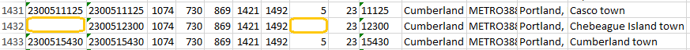
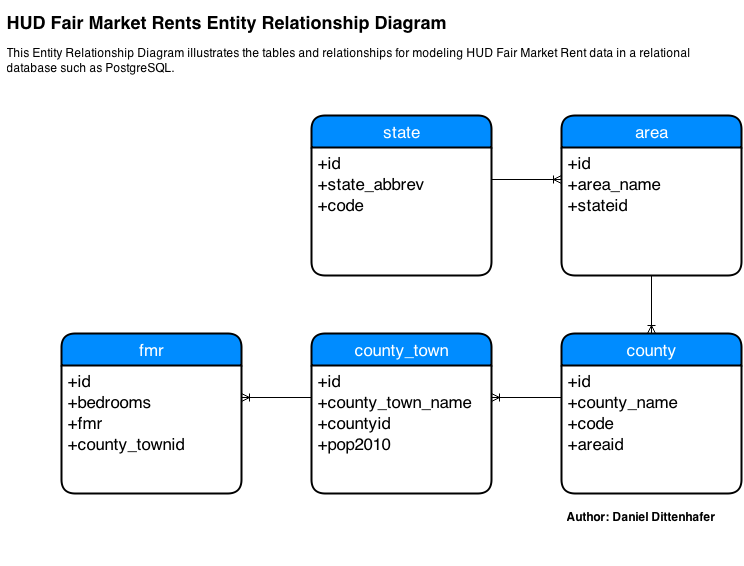

### Introduction ###

This study compares the data storage and querying capability of R, PostgreSQL and MongoDB using a common data set as described in the next section. Commentary regarding advantages and disadvantages, as well as specific experiences with the scenario data set are presented. Finally, a recommended technology is put forward with supporting points. An appendix including comparable sample code is provided as well.

### Data Set Use Case ###

The data set used in this comparative study was obtained from the U.S. Department of Housing and 
Urban Development (HUD). It contains fair market rent (FMR) data points for counties and 
metropolitan statisitcal areas through-out the United States of America. The FMR data points
are required to be published by as part of Section 8 of the United States Housing Act of 1937.

FMR data is used by programs operating under Section 8 including the Housing Choice Voucher,
the Moderate Rehabilitation, and the project-based voucher programs. External to these programs,
this data set can be used to better understand differences in housing costs around the United States,
and if compared to other years, how costs are changing over time.

### Advantages / Disadvantages ###

#### R ####

The R runtime provides several functions for saving and loading data in the RData format. The `save` function will persist one or more variables to a specified file in either ASCII or binary format, and likewise the `load` function will deserialize the data from a given file into the R runtime's environment.

The RData format and associated functions are quite useful for importing and/or sharing small data sets, as well as preserving work from day to day. Mid-sized data sets (< 8GB) could be serialized using these functions as well, wherein the `compress` option might be a significant benefit. 

Beyond the use cases described above, the RData format is unlikely to be useful 
for larger data sets (8+ GB). The R runtime wants to place any data loaded from
RData files into the environment's memory space. Depending on your operating system
some of this may be swapped to disk, but nonetheless working memory is now limited
due to the presence of the loaded data.

Simultaneous access by multiple users could also be a problem. Once a data set
is loaded from a given file, another user could also load the same data from the file,
for example if the file is shared on a network drive. Sharing changes presents a problem though.
The entire data set would need to be serialized back to the file and notifications broadcast
to colleagues of the need to reload the file (thereby losing any changes they had made).

In terms of security, if an unauthorized user were to acquire an RData file, there is no inherent
permissions management to prevent them from accessing and/or updating the data. 

For the Fair Market Rents data set, R's `read.table` function did not handle some of the 
encoding used in place names even when both the `latin1` and `UTF-8` were specified for the encoding parameter.

A portion of the data was able to be loaded, and once loaded R's querying and data analytic capabilities shined.

#### PostgreSQL ####

[PostgreSQL](http://www.postgresql.org/about/) is an open source relational database management
system (RDBMS) which stores data in databases and tables hosted through a separate data service 
typically on a separate server.

PostgreSQL is well suited for persisting data sets ranging from kilobytes to terabytes. According to the PostgreSQL website, a given database in not limited in size, and a given table within a database can be as large as 32TB. Since the data is hosted on a central server, sharing across multiple users is much simpler than the RData scenario. Each user can connect and query the data independently, and PostgreSQL manages the access (security) as well as any updates that might be committed.

Once data is in a PostgreSQL database, sharing the data within an organization is very straight forward. Any user with permission can connect and query from a wide range of client applications. Sharing the data outside an organization is much more difficult.
The data could be exported to a CSV file for example, though depending on the size of the data set, this might not be feasible. Alternatively, a web application interface might be developed to enable external access while maintaining security for other data sources.

For the Fair Market Rent data set, PostgreSQL pgAdmin's import utility was used to load the data from the
CSV into a staging table very smoothly, including the handling of latin1 encoded characters, without issue. 
The staging table had to be predefined and created within a pre-created database before the import utility was used.
See the Appendix - PostreSQL Code section for details regarding the database design and normalization
after the raw data was loaded. 

Although not strictly necessary, normalizing the data, such as state and county names, into look-up tables is considered best practice in RDBMS database design. Normalization requires several extra steps that might not be necessary for all data sets. In the case of the Fair Market Rent data, the normalization process revealed some missing data (a FIPS and county code) for Cumberland County, ME as shown in the following screenshot.




#### MongoDB ####

[MongoDB](http://www.mongodb.org/about/introduction/) is an open source NoSQL document data store. As such, no pre-defined schemas are needed in order to import data and importing raw data from a CSV or JSON data file into a MongoDB collection generally requires less preparation than with PostgreSQL (the schema definition and database/table creation).

Like many NoSQL data stores, MongoDB is built to handle large data sets (as large as 128TB in MongoDB's case), but it is also quite useful for managing smaller data sets such as our Fair Market Rent data. 

Like PostgreSQL, MongoDB provides security mechanisms for authenticating and authorizing client
users. Also like PostgreSQL and R, MongoDB supports querying across all fields and producing
aggregations from the data (many NoSQL solutions, such as HBASE, don't support this). 

As part of the schemaless design of MongoDB, normalization is typically not applied to raw data. In MongoDB, references between documents are mostly manual, though there is a concept of DBRef which appears to offer similar functionality as traditional RDBMS foreign key relationships. Some data scenarios, including our Fair Market Rent scenario, don't absolutely require normalization, but others benefit from the data typing and relationship enforcement that an RDBMS provides.

For the Fair Market Rent data set, the `mongoimport.exe` utility was used for data import. 
As mentioned previously, the data was in a Latin 1 encoding, which MongoDB doesn't support. 
The utility did the best it could and imported all rows which didn't have Latin 1 specific encoding.
The data set was reimported after converting it to UTF-8 (via Notepad++) and `mongoimport` 
performed as expected and imported all rows without issue.


### Recommendation ###

For smaller data sets, particularlly those that load into R cleanly using the `read.table` function, 
RData seems to be the best option for storing and quickly reloading data. With that said, based on the experiences with the Fair Market Rent data set and encoding, MongoDB is the clear stand-out for easy of import and the power it offers for querying and sharing data within a organization.

### Appendix ###

#### Data Set Description ####
 
The specific data set used is the 2015 Fair Market Rent Country Level Data File:

http://www.huduser.org/portal/datasets/fmr/fmr2015f/FY2015F_4050_Final.xls

The data set was downloaded in Microsoft Excel format (XLS) and saved to CSV format to enable
easier access by the various technologies used throughout this study.

----------------------------------------------------------------------------------------------------
Data Set         Number of              Attribute              Number of 
Characteristics  Observations Area      Characteristics        Attributes Missing Values?
--------------- ------------- --------- ---------------------- ---------- ---------------
Multivariate    4,769         Business  Categorical, Integer,  18         Yes    
                                        String  
--------------------------------------- ---------------------- ---------- ---------------

#### Attribute Information ####

The following table lists the data types and a brief description of the fields contained 
in the data set used in this comparative study.

-------------------------------------------------------------------------------
Field                Data Type     Description
-------------------  ------------- --------------------------------------------
fips2000             integer       2000 Census 10-digit state, county, metro code

fips2010             integer       2010 Census 10-digit state, county, metro code

fmr2                 integer       2 bedroom fair market rent

fmr0                 integer       0 bedroom (studio) fair market rent

fmr1                 integer       1 bedroom fair market rent

fmr3                 integer       3 bedroom fair market rent

fmr4                 integer       4 bedroom fair market rent

county               integer       County number

State                integer       State number

CouSub               integer       County Sub number

countyname           string        County Name

Metro_code           string        METROxxxxxxMxxxxx for metropolitan areas and 
                                   NCNTYxxxxxNxxxxx for nonmetropolitan counties

Areaname             string        Area name
 
county_town_name     string        Locality name to which the pop2010 field is relevant

pop2010              integer       Population of locality from 2010 Census

state_alpha          string        2 character abbreviation for State

fmr_type             integer       Percentile of FMR  

metro                binary        1 = Metro, 0 = non-metro county

---------------------------------------------------------------------

#### R Code ####
The following R code demonstrates loading the data set from CSV format, and manipulating
to ensure proper data typing.

```{r, echo=FALSE}
require(ggplot2, quietly=TRUE)
projRoot <- "C:/Code/R/DataAcqMgmt"

# Disable warnings
options(warn=-1)  
```

```{r}
# Load the data into a data.frame
csv_file <- file.path(projRoot, "Week10", "Data", "FY2015F_4050_Final-utf8.csv")
csv <- read.table(csv_file, header=TRUE, sep=",", 
                  fill=TRUE, stringsAsFactors=FALSE, encoding="UTF-8")

# Data types and scaling
dfFmrData <- data.frame(csv)
dfFmrData$fmr0 <- as.numeric(csv$fmr0)
dfFmrData$fmr1 <- as.numeric(csv$fmr1)
dfFmrData$fmr2 <- as.numeric(csv$fmr2)
dfFmrData$fmr3 <- as.numeric(csv$fmr3)
dfFmrData$fmr4 <- as.numeric(csv$fmr4)
dfFmrData$state_alpha <- as.factor(csv$state_alpha)
dfFmrData$metro <- as.numeric(csv$metro)
dfFmrData$pop2010 <- as.numeric(csv$pop2010) / 1000000

# Save to RData format
savePath <- file.path(projRoot, "Week10", "Data", "FMR_FY2015_Final.RData")
save(dfFmrData, file=savePath)

# Load from RData format
load(savePath)

```

```{r, echo=FALSE}
g5 <- ggplot(data=dfFmrData, aes(x=pop2010))
g5 <- g5 + geom_point(aes(y=fmr0, colour="Studio"))
g5 <- g5 + geom_point(aes(y=fmr2, colour="2 Bedroom"))
g5 <- g5 + geom_point(aes(y=fmr3, colour="3 Bedroom"))
g5 <- g5 + scale_fill_hue(l=40)
g5 <- g5 + ylim(0, 3000)
g5 <- g5 + theme(axis.text.x = element_text(angle=30, vjust=1))
g5 <- g5 + guides(colour = guide_legend("Legend"))
g5 <- g5 + labs(title="Fair Market Rent vs. 2010 Census",
                x="2010 Census Population (Millions)",
                y="Fair Market Rent (USD)")
g5

```

```{r, echo=FALSE}
summary(dfFmrData)
```

#### PostgreSQL Code ####

The following entity relationship diagram shows the database design created during the PostgreSQL portion of this comparative study. 



Data was first imported into a staging table in PostgreSQL via the pgAdmin Import utility. After the
data was imported, SQL statements were used to split the data into the appropriate tables as shown in the code segment below.

``` sql
-- Normalize state info
INSERT INTO state (state_abbrev, code) 
  SELECT DISTINCT state_alpha, to_number(state, '99') 
  FROM staging ORDER BY state_alpha

-- Normalize area info
INSERT INTO area (area_name, stateid) 
  SELECT DISTINCT areaname, s.id
		FROM staging st
		INNER JOIN state s ON s.state_abbrev = st.state_alpha
		ORDER BY areaname

-- Normalize county info
INSERT INTO county (county_name, code, areaid) 
	SELECT DISTINCT countyname, to_number(county, '999'), a.id 
		FROM staging st
		INNER JOIN state s ON s.state_abbrev = st.state_alpha 
		INNER JOIN area a ON a.area_name = st.areaname AND a.stateid = s.id
		ORDER BY countyname

-- Normalize county_town info
INSERT INTO county_town (county_town_name, countyid, pop2010) 
	SELECT DISTINCT county_town_name, c.id, to_number(pop2010, '999999999')
		FROM staging st
		INNER JOIN state s ON s.state_abbrev = st.state_alpha
		INNER JOIN area a ON a.area_name = st.areaname AND a.stateid = s.id
		INNER JOIN county c ON c.county_name = st.countyname AND c.areaid = a.id
		ORDER BY county_town_name

INSERT INTO fmr (bedrooms, fmr, county_townid) 
	SELECT 0, to_number(fmr0, '999999'), ct.id
		FROM staging st
		INNER JOIN state s ON s.state_abbrev = st.state_alpha
		INNER JOIN area a ON a.area_name = st.areaname AND a.stateid = s.id
		INNER JOIN county c ON c.county_name = st.countyname AND c.areaid = a.id
		INNER JOIN county_town ct ON ct.county_town_name = st.county_town_name 
      AND ct.countyid = c.id

INSERT INTO fmr (bedrooms, fmr, county_townid) 
	SELECT 1, to_number(fmr1, '999999'), ct.id
		FROM staging st
		INNER JOIN state s ON s.state_abbrev = st.state_alpha
		INNER JOIN area a ON a.area_name = st.areaname AND a.stateid = s.id
		INNER JOIN county c ON c.county_name = st.countyname AND c.areaid = a.id
		INNER JOIN county_town ct ON ct.county_town_name = st.county_town_name 
      AND ct.countyid = c.id		

INSERT INTO fmr (bedrooms, fmr, county_townid) 
	SELECT 2, to_number(fmr2, '999999'), ct.id
		FROM staging st
		INNER JOIN state s ON s.state_abbrev = st.state_alpha
		INNER JOIN area a ON a.area_name = st.areaname AND a.stateid = s.id
		INNER JOIN county c ON c.county_name = st.countyname AND c.areaid = a.id
		INNER JOIN county_town ct ON ct.county_town_name = st.county_town_name 
      AND ct.countyid = c.id

INSERT INTO fmr (bedrooms, fmr, county_townid) 
	SELECT 3, to_number(fmr3, '999999'), ct.id
		FROM staging st
		INNER JOIN state s ON s.state_abbrev = st.state_alpha
		INNER JOIN area a ON a.area_name = st.areaname AND a.stateid = s.id
		INNER JOIN county c ON c.county_name = st.countyname AND c.areaid = a.id
		INNER JOIN county_town ct ON ct.county_town_name = st.county_town_name 
      AND ct.countyid = c.id

INSERT INTO fmr (bedrooms, fmr, county_townid) 
	SELECT 4, to_number(fmr4, '999999'), ct.id
		FROM staging st
		INNER JOIN state s ON s.state_abbrev = st.state_alpha
		INNER JOIN area a ON a.area_name = st.areaname AND a.stateid = s.id
		INNER JOIN county c ON c.county_name = st.countyname AND c.areaid = a.id
		INNER JOIN county_town ct ON ct.county_town_name = st.county_town_name 
      AND ct.countyid = c.id
```

Using a query such as the following, R can be used to query the PostgreSQL data and produce a similar
chart as in the R code shown previously.

```{r}
require("RPostgreSQL")

# PostgreSQL - connect
drv <- dbDriver("PostgreSQL")
con <- dbConnect(drv,user="postgres",password="a",dbname="proj4")

# Query the Postgres data tables
sQuery <- "SELECT ct.pop2010 / 1000000.0 AS pop2010, 
                  fmr0.fmr AS fmr0, 
                  fmr2.fmr AS fmr2, 
                  fmr3.fmr AS fmr3 FROM  county_town ct 
  LEFT JOIN fmr fmr0 ON fmr0.county_townid = ct.id AND fmr0.bedrooms = 0
  LEFT JOIN fmr fmr2 ON fmr2.county_townid = ct.id AND fmr2.bedrooms = 2
  LEFT JOIN fmr fmr3 ON fmr3.county_townid = ct.id AND fmr3.bedrooms = 3" 
res <- dbGetQuery(con, sQuery)

g6 <- ggplot(data=res, aes(x=pop2010))
g6 <- g6 + geom_point(aes(y=fmr0, colour="Studio"))
g6 <- g6 + geom_point(aes(y=fmr2, colour="2 Bedroom"))
g6 <- g6 + geom_point(aes(y=fmr3, colour="3 Bedroom"))
g6 <- g6 + scale_fill_hue(l=40)
g6 <- g6 + ylim(0, 3000)
g6 <- g6 + theme(axis.text.x = element_text(angle=30, vjust=1))
g6 <- g6 + guides(colour = guide_legend("Legend"))
g6 <- g6 + labs(title="Fair Market Rent vs. 2010 Census (via PostgreSQL)",
                x="2010 Census Population (Millions)",
                y="Fair Market Rent (USD)")
g6

```

#### MongoDB Code ####

For simplicity, the data was left as it was after importing via `mongoimport`. 

MongoDB is accessible from many clients including R. The following code demonstrates accessing the Fair Market Rent data via the rmongodb package and producing the familiar Rent vs. Population chart as in
the previous examples.

```{r, echo=FALSE}
mongohost <- "localhost:27017"
user <- ""
pass <- ""
db <- "proj4"
authdb <- db
```

```{r}
require (rmongodb)

# Create connection to the mongo database
mongo <- mongo.create(host=mongohost, username=user, password=pass, db=authdb)

# Get the FMR data frame
query <- "{ }"
fields <- "{ \"pop2010\": 1, \"fmr0\": 1, \"fmr2\": 1, \"fmr3\": 1}"
ns = sprintf("%s.%s", db, "fmr2015")
cursor <- mongo.find(mongo, ns, query, fields = fields)
dfFmrMongo <- mongo.cursor.to.data.frame(cursor)

# Scale the population
dfFmrMongo$pop2010 <- dfFmrMongo$pop2010 / 1000000.0

g7 <- ggplot(data=dfFmrMongo, aes(x=pop2010))
g7 <- g7 + geom_point(aes(y=fmr0, colour="Studio"))
g7 <- g7 + geom_point(aes(y=fmr2, colour="2 Bedroom"))
g7 <- g7 + geom_point(aes(y=fmr3, colour="3 Bedroom"))
g7 <- g7 + scale_fill_hue(l=30)
g7 <- g7 + ylim(0, 3000)
g7 <- g7 + theme(axis.text.x = element_text(angle=30, vjust=1))
g7 <- g7 + guides(colour = guide_legend("Legend"))
g7 <- g7 + labs(title="Fair Market Rent vs. 2010 Census (via MongoDB)",
                x="2010 Census Population (Millions)",
                y="Fair Market Rent (USD)")
g7

```

### Source Code ###

The raw R markdown and other code used in this comparative study can be found 
[on GitHub, in my DataAcqMgmt repository](https://raw.githubusercontent.com/dwdii/DataAcqMgmt/master/Week10).

### References ###

"About." PostgreSQL:. N.p., n.d. Web. 02 Nov. 2014. <http://www.postgresql.org/about/>.

"Final Fair Market Rents for the Housing Choice Voucher Program and Moderate Rehabilitation Single Room Occupancy Program Fiscal Year 2015, Docket No. FR-5807-N-03; Notice of Final Fiscal Year (FY) 2015 Fair Market Rents (FMRs)," 70 Federal Register 192 (3 October 2014), pp 59786-59792.

"MongoDB Limits and Thresholds." MongoDB Limits and Thresholds — MongoDB Manual 2.6.4. MongoDB, Inc., n.d. Web. 03 Nov. 2014. <http://docs.mongodb.org/manual/reference/limits/>.

"R: Save R Objects." R: Save R Objects. R Project, n.d. Web. 02 Nov. 2014. <http://stat.ethz.ch/R-manual/R-patched/library/base/html/save.html>.

"What Are the Disadvantages of Using .Rdata Files Compared to HDF5 or NetCDF?" StackOverflow.com. Stack Exchange Inc., 25 Oct. 2011. Web. 02 Nov. 2014. <http://stackoverflow.com/a/7890475>.

