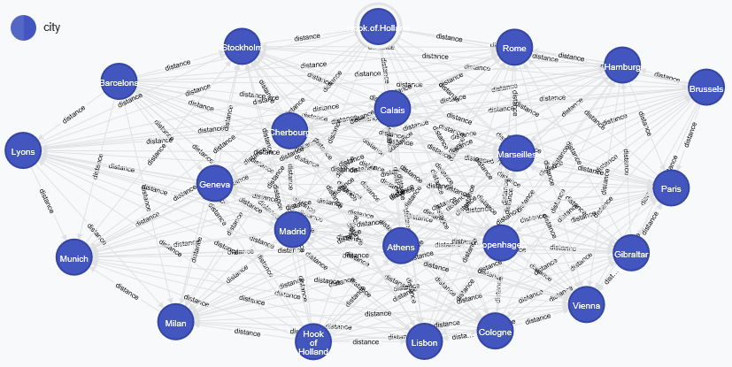
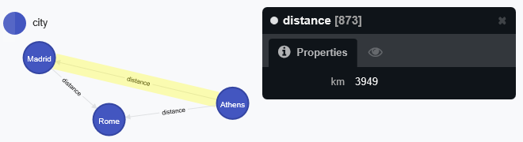

```{r, echo=FALSE}
options(warn=-1)
require(knitcitations, quietly=TRUE)
require(RefManageR, quietly=TRUE)

cleanbib()

cite_options(style="markdown")

bibEuroDist <- citation("datasets")

bibRNeo4j <- citation("RNeo4j")

bibRNeo4jblog <- bibentry(bibtype="Misc", 
             title="Upload Your Last.fm Data to Neo4j with RNeo4j and the Transactional Endpoint", 
             author=as.person("Nicole White"),
             year="2014",
             url="http://nicolewhite.github.io/r/2014/09/30/upload-last-fm-rneo4j-transaction.html")
bibShortPath <- bibentry(bibtype="Misc",
                        title="Finding the Shortest Path through the Park", 
                         author=as.person("Rik van Bruggen"),
                         year="2013",
                         url="http://neo4j.com/blog/finding-the-shortest-path-through-the-park/")
             
```
The data set used in this exercise is the eurodist data set included with R `r citep(bibEuroDist)`. As a result of the data set being inherently available in R, R will be used to load the data into Neo4j via the `RNeo4j` package `r citep(bibRNeo4j)`.
```{r}
require("stats")
require("plyr", quietly=TRUE)
if(!require("RNeo4j", quietly=TRUE)) {
  devtools::install_github("nicolewhite/RNeo4j")
}
```

### The Data ###
What does the `eurodist` data look like? The `eurodist` data comes to us in a special format using the `dist` data type, but can be easily converted to a matrix for readability and other data transformation activities. At the time of this writing, the `dist` class did not support direct coercion to data.frame, therefore `matrix` is used as a vehicle. The rownames (cities) are bound
as an additional column to aid with the data mapping. A portion of the data set is shown below for illustration.
```{r}
euromat <- as.matrix(datasets::eurodist)
euroDF <- data.frame(euromat)
euroDF <- cbind(euroDF, city=rownames(euroDF))
head(euroDF[,1:7])
```

### Neo4j ###
For this exercise, the data will be loaded into a local instance of Neo4j. 

```{r}
# Connect to the Neo4J server.
graph = startGraph("http://localhost:7474/db/data/")
```

Using guidance from a blog post by Nicole White, a Data Scientist at Neo4j,
the `RNeo4j` package is used to add nodes and edges derived from the `eurodist` 
data `r citep(bibRNeo4jblog)`.

First the import query is defined. This query uses parameters and can be reused
in repeated calls to `appendCypher` as shown in the `neoLoadFunc` below. The Cypher query
merges in each city, checks if a distance has already been loaded in the opposite direction
for the city pair, and if not then merges in the distance relationship.

```{r}
# Data loading Cypher query
query <- "
MERGE (city:city {name: {name}})
MERGE (otherCity:city {name: {otherCity}})
WITH city, otherCity
  WHERE NOT (otherCity)-[:distance]->(city)
MERGE (city)-[dist:distance {km: {kmdist}}]-(otherCity)
"
```

Next the data loading function, named `neoLoadFunc` in this example, is defined. This function is called by `d_ply` once for each row in the data.frame. It then iterates across the columns (also cities) to load each pair and the associated distance.

```{r}
# The data loading function - called once per city row
neoLoadFunc <- function(r, tx, query) {
  # Looping over each column
  for(cn in colnames(r)) {
    if(identical(cn, "city")) {
      # Skip the city column
    } else {
      km <- as.numeric(r[cn])
      if(identical(0, km)) {
        # Skip same city
      } else {
        #print(sprintf("%s - %d - %s", r$city, as.numeric(r[cn]), cn))
        appendCypher(tx,
                     query,
                     name=r$city,
                     otherCity=cn,
                     kmdist=as.numeric(r[cn])
                 )           
      }
    }
  }
}

```

The code segment below glues to together what you've seen above. A Neo4j transaction is initiated.
`d_ply` is used to split the data by city and apply the `neoLoadFunc` to each city row. Finally, the
Neo4j transaction is committed.

```{r}
# Start initial transaction.
tx = newTransaction(graph)
# Use plyr function to split and apply to each row via the newLoadFunc defined earlier.
d_ply(euroDF, tx, query, .variables="city", .fun=neoLoadFunc)
# Commit transaction to ensure persistence in Neo4j
commit(tx)
```

The following graph structure results:
```{r}
summary(graph)
```



### Querying the Data ###

#### Nearest Cities ####

What are the cities nearest each other? 

```{r}
query <- "
MATCH (city:city)-[d:distance]->(otherCity:city)
  WHERE NOT (otherCity:city)-[d:distance]->(city:city)
RETURN DISTINCT city.name, d.km, otherCity.name
ORDER BY d.km
LIMIT 5
"
```

```{r}
cypher(graph, query)
```

It appears there is a bad name in the data. "Hook.of.Holland" has periods where spaces should be!

#### Shortest Path ####

What is the shortest path between Athens and Madrid? Presumably this would be the single distance from the 
data, 3949 km. The following shortest path query is derived from a Neo4j blog post `r citep(bibShortPath)`. Lets see what it returns.
       
```{r}
query <- "
MATCH  (startNode:city {name:'Athens'})
MATCH  (endNode:city {name:'Madrid'})
MATCH  p=(startNode)-[:distance*1..2]-(endNode)
RETURN 
       extract(n IN nodes(p)| n.name) AS city_path,
       reduce(distance=0, r in relationships(p) | distance+r.km) AS totalDistance
       ORDER BY totalDistance ASC
       LIMIT 1;
"
```

```{r}
cypher(graph, query)
```
Interestingly, the shortest path analysis has discovered a route through Rome that claims to be shorter than
the direct Athens - Madrid path. Maybe this is a flaw with the original data?



### Graph vs Relational? ###

What are the advantages and disadvantages of having the `eurodist` data in a graph database versus a relational database? 

#### Advantages ####
Although the nearest cities query could be achieved in a relational database, the graph database is designed for the edge style query that this distant data is all about. Additionally, since the data is road distance, a shortest-path analysis can be easily performed in the graph database as shown in the sample shortest path query above.

#### Disadvantages ####
For this data set, the graph database seems like a natural fit and it is hard to come up with disadvantages. If the data were to grow to the point where sharding would be needed, it might be more challenging with a graph database, but continental boundaries might be the natural paritioning scheme for these road distances. 

### Source Code ###
The raw R markdown code used to produce this article can be found 
[on GitHub, in my DataAcqMgmt repository](https://raw.githubusercontent.com/dwdii/DataAcqMgmt/master/Week13/Project5-LoadingDataIntoNeo4j.Rmd).

### References ###

```{r, results='asis', echo=FALSE}
BibOptions(style="html", bib.style="authortitle")
bibliography()
```
